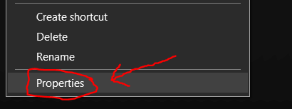
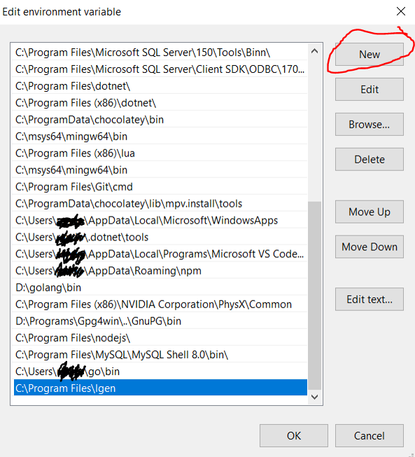

# lgen
lgen is a rust cli (command line interface) tool for genarateing licences, see install guide below.

# commands

gen, help.

# licences

mit, apche2, cc0, gpl3.

# Download the latest stable release from github. 

# Download the exe.

# Find the exe in your downloads.

# Move the exe to desktop.

# Go to programing files, press 'windows + r' then type 'C:\Program Files'.

# Create a new folder named lgen.

# Move exe to new folder.

# Right click on the exe to open up properties.

# Highlight the file path and copy, 'ctrl + c'. 

# Search for enviroment var, press windows then type 'enviro', click open.

# Click on enviroment vars.

# Find path and then click edit.

# Press new and enter the file path for the exe folder 'C:\Program Files\lgen', this will make any file in there be accesible via typeing the name in cmd.

# Time to test it, press 'windows + r' and type 'cmd'.

# Type 'lgen' in and press 'enter', you should see it say 'no command or licence givin'.

# Type 'cd desktop' so we can crete the licence on the desktop.

# Type 'lgen gen mit' in and press 'enter', you should see it say 'generateing mit licence'.

# You should see a new file called LICENCE pop up, open it with note pad and check it says mit licence, change the copyright holder and date and your finished!
